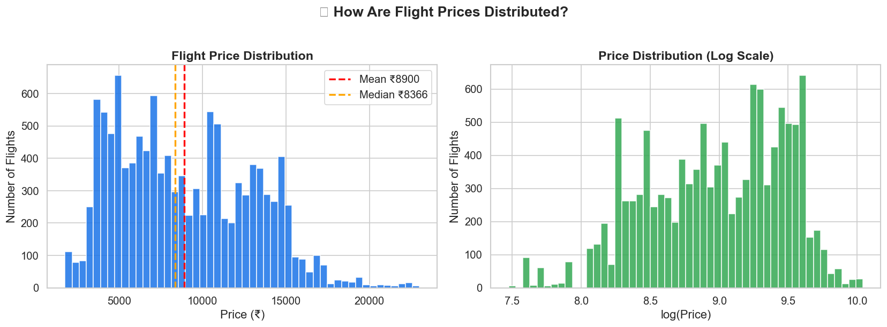

# ✈️ SkyFare AI — Premium ML Flight Analytics

<p align="center">
  
</p>

<div align="center">

[](https://www.python.org/)
[](https://flask.palletsprojects.com/)
[](https://react.dev/)
[](https://threejs.org/)
[](https://scikit-learn.org/)

</div>

**SkyFare AI** is a premium Machine Learning web application and visual diagnostics dashboard designed to predict and analyze domestic flight ticket prices in India. Powered by a high-generalization **Random Forest Regressor** (scoring **98.7% training $R^2$**), the system combines data-cleaning pipelines, statistical outlier removal, model serialization, and a modern, glassmorphic analytics interface with real-time 3D flight route simulation.

---

## 🚀 Key Features

*   **Interactive 3D India Route Map**: Powered by **Three.js**, the visualizer projects domestic routes onto a glowing, pseudo-3D particle map of India, drawing Bezier flight curves and animating a highly detailed, realistic commercial airliner (featuring swept-back wings, dual jet engines, and Indigo-branded tail fins) oriented dynamically along the flight path vector.
*   **Aesthetic Diagnostic Dashboard**: A React-driven interactive interface displaying Exploratory Data Analysis (EDA) figures, density curves, correlation plots, and seasonal insights with full-screen inspect modes. Includes a real-time price simulator algorithm!
*   **Predictive Inference Engine**: Real-time server-side price prediction utilizing the serialized Random Forest model with calculated lower/upper bound variance confidence estimates.
*   **Advanced Feature Engineering**:
    *   **Geographic Haversine Distance**: Calculates the actual great-circle distance (in km) between airport coordinate projections.
    *   **Temporal Hour Bucketing**: Slots flight times to model morning premiums and night budget advantages.
    *   **Layover Analysis**: Incorporates stop-counts and layover flags to gauge distance/time multipliers.

---

## 📁 Project Structure

```text
ML-Project/
├── data/
│   └── Data_Train.xlsx           # Dataset containing ~11,800 domestic flight entries
├── models/
│   ├── rf_model.pkl              # Serialized Random Forest Regressor (100 Trees)
│   └── rf_columns.pkl            # Selected feature matrix columns for alignment
├── notebooks/
│   └── Flight_Merged.ipynb       # Jupyter Notebook for exploratory pipeline tests
├── scripts/
│   ├── train.py                  # Jupyter-equivalent training & EDA script
│   └── serialize_model.py        # Model training and artifact serialization script
├── static/
│   ├── chart1_price_distribution.png
│   ├── chart2_price_airline.png
│   ├── ...                       # EDA diagrams & outlier plots
├── templates/
│   ├── index.html                # Main SkyFare AI 3D Analytics Dashboard & Simulator
│   └── predictor.html            # Standalone Legacy Flight Predictor Tool
├── app.py                        # Flask backend server & prediction API
└── requirements.txt              # Standard Python project requirements
```

---

## 📊 Exploratory Visualizations & Insights

The visualizer loads the following analysis plots directly from the `static/` directory:
1.  **Price Distribution** (`chart1_price_distribution.png`): Highlights concentration profiles between ₹4,000 and ₹12,000.
2.  **Price by Airline** (`chart2_price_airline.png`): Demonstrates median differences between budget carriers (IndiGo, SpiceJet) and premium business tiers.
3.  **Stops Impact** (`chart3_price_stops.png`): Details how multiple layovers skew pricing due to additional flight distance segments.
4.  **Duration Correlation** (`chart4_price_duration.png`): Validates travel time as a direct multiplier of operational costs.
5.  **Seasonal Trends** (`chart5_price_month.png`): Tracks seasonal booking surges and flight density peaks.
6.  **Outlier Analysis** (`plot_outliers_before.png`): Showcases skewness correction via Interquartile Range (IQR) bounds.

---

## 🛠️ Setup & Installation

### 1. Clone & Initialize Environment
```bash
# Clone the repository
git clone https://github.com/Keshav-Bhatnagar/ML-Project.git
cd ML-Project

# Create a virtual environment
python -m venv venv
venv\Scripts\activate  # On Linux/macOS use: source venv/bin/activate

# Install dependencies
pip install -r requirements.txt
```

### 2. Retrain/Serialize Model (Optional)
If you want to train the model from scratch and recreate the pickle files inside `models/`:
```bash
python scripts/serialize_model.py
```

### 3. Launch the Web Application
```bash
python app.py
```

> [!TIP]
> The Flask server automatically maps your endpoints!
> 
> 🌌 **Access the premium 3D diagnostics map at:** **[http://localhost:5000/](http://localhost:5000/)**
> 
> ✈️ **Access the standalone legacy predictor at:** **[http://localhost:5000/predictor](http://localhost:5000/predictor)**

---

## 🛡️ License

This project is created for educational and academic machine learning analysis.
